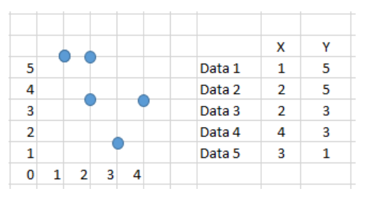
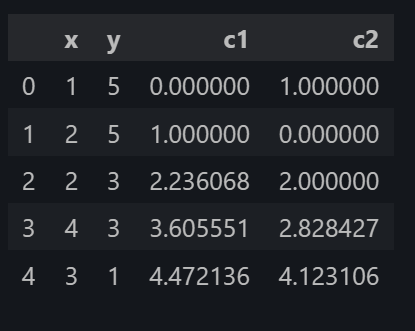
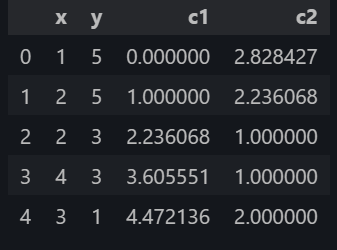
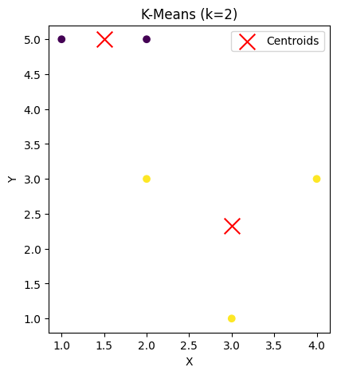

## There are 5 data as follows. Perform clustering using:

agglomerative hierarchical algorithm

* single link
* complete link

kmeans algorithm (k=2 and  with the first 2 )

# Single link

1. Initial distance matrix:

|    | D1    | D2    | D3   | D4   | D5 |
| ---- | ------- | ------- | ------ | ------ | ---- |
| D1 | 0     |       |      |      |    |
| D2 | 1     | 0     |      |      |    |
| D3 | 2.24  | 2     | 0    |      |    |
| D4 | 3.61  | 2.828 | 2    | 0    |    |
| D5 | 4.472 | 4.123 | 2.24 | 2.24 | 0  |

he distance is given by:

- $d(2,1) = \sqrt{(1-2)^2+(5-5)^2} = 1$
- $d(3,1) = \sqrt{(1-2)^2+(5-3)^2} = \sqrt{5}≈2.236$
- $d(4,1) = \sqrt{(1-4)^2+(5-3)^2} = \sqrt{13}≈3.606$
- $d(5,1) = \sqrt{(1-3)^2+(5-1)^2} = \sqrt{20}≈4.472$
- $d(2,3) = \sqrt{(2-2)^2+(5-3)^2} = \sqrt{4}≈2$
- $d(2,4) = \sqrt{(2-4)^2+(5-3)^2} = \sqrt{8}≈2.828$
- $d(2,5) = \sqrt{(2-3)^2+(5-1)^2} = \sqrt{17}≈4.123$
- $d(3,4) = \sqrt{(2-4)^2+(3-3)^2} = \sqrt{4}≈2$
- $d(3,5) = \sqrt{(2-3)^2+(3-1)^2} = \sqrt{5}≈2.236$
- $d(4,5) = \sqrt{(4-3)^2+(3-1)^2} = \sqrt{5}≈2.236$

Bottom-Up (agglomerative):

<table>
<tbody>
<tr>
<td> </td><td>D1</td><td>D2</td><td>D3</td><td>D4</td><td>D5</td>
</tr>
<tr>
<td>D1</td><td>0</td><td> </td><td> </td><td> </td><td> </td>
</tr>
<tr>
<td>D2</td><td >1</td><td>0</td><td> </td><td> </td><td> </td>
</tr>
<tr>
<td>D3</td><td>2.24</td><td>2</td><td>0</td><td> </td><td> </td>
</tr>
<tr>
<td>D4</td><td>3.61</td><td>3.16</td><td>2</td><td>0</td><td> </td>
</tr>
<tr>
<td>D5</td><td>2.83</td><td>2.83</td><td>2.24</td><td>2.24</td><td>0</td>
</tr>
</tbody>
</table>
This table represents the initial distance matrix for the given data points. The smallest distance (1.0 between D1 and D2) would be highlighted or considered first in the clustering process.

In each table, the smallest distance (which determines the next merge) is highlighted in red.

Step 1: Calculate the distance matrix

|    | D1                            | D2    | D3    | D4    | D5 |
| ---- | ------------------------------- | ------- | ------- | ------- | ---- |
| D1 | 0                             |       |       |       |    |
| D2 | $\textcolor{red}{\textsf{1}}$ | 0     |       |       |    |
| D3 | 2.236                         | 2     | 0     |       |    |
| D4 | 3.606                         | 2.828 | 2     | 0     |    |
| D5 | 4.472                         | 4.123 | 2.236 | 2.236 | 0  |

Step 2: Merge D1 and D2 (smallest distance: 1)

|         | (D1,D2)                       | D3    | D4    | D5 |
| --------- | ------------------------------- | ------- | ------- | ---- |
| (D1,D2) | 0                             |       |       |    |
| D3      | $\textcolor{red}{\textsf{2}}$ | 0     |       |    |
| D4      | 2.828                         | 2     | 0     |    |
| D5      | 4.123                         | 2.236 | 2.236 | 0  |

- $d(D3,(D1,D2))= min[(D3,D1), (D3,D2)] = 2 $
- $d(D4,(D1,D2))= min[(D4,D1), (D4,D2)] = 2.828 $
- $d(D5,(D1,D2))= min[(D5,D1), (D5,D2)] = 4.123$

Step 3: Merge (D1,D2) and D3 (smallest distance: 2)

|              | ((D1,D2),D3)                  | D4    | D5 |
| -------------- | ------------------------------- | ------- | ---- |
| ((D1,D2),D3) | 0                             |       |    |
| D4           | $\textcolor{red}{\textsf{2}}$ | 0     |    |
| D5           | 2.236                         | 2.236 | 0  |

- $d(D4,((D1,D2),D3))= min[(D4,(D1,D2)), (D4,D3)] = 2$
- $d(D5,((D1,D2),D3))= min[(D5,(D1,D2)), (D5,D3)] = 2.236$

Step 4: Merge ((D1,D2),D3) and D4 (smallest distance: 2)

|                   | (((D1,D2),D3),D4)                 | D5 |
| ------------------- | ----------------------------------- | ---- |
| (((D1,D2),D3),D4) | 0                                 |    |
| D5                | $\textcolor{red}{\textsf{2.236}}$ | 0  |

- $d(D5,((D1,D2),D3),D4)= min[(D5,(D1,D2),D3), (D5,D4)] = 2.236$

Step 5: Final merge (((D1,D2),D3),D4) and D5 (distance: 2.236)

# Complete link

Step 1: Calculate the distance matrix

|    | D1                            | D2    | D3    | D4    | D5 |
| ---- | ------------------------------- | ------- | ------- | ------- | ---- |
| D1 | 0                             |       |       |       |    |
| D2 | $\textcolor{red}{\textsf{1}}$ | 0     |       |       |    |
| D3 | 2.236                         | 2     | 0     |       |    |
| D4 | 3.606                         | 2.828 | 2     | 0     |    |
| D5 | 4.472                         | 4.123 | 2.236 | 2.236 | 0  |

Step 2: Merge D1 and D2 (smallest distance: 1)

|         | (D1,D2) | D3                            | D4    | D5 |
| --------- | --------- | ------------------------------- | ------- | ---- |
| (D1,D2) | 0       |                               |       |    |
| D3      | 2.236   | 0                             |       |    |
| D4      | 3.606   | $\textcolor{red}{\textsf{2}}$ | 0     |    |
| D5      | 4.472   | 2.236                         | 2.236 | 0  |

- $d(D3,(D1,D2))= max[(D3,D1), (D3,D2)] = 2.236 $
- $d(D4,(D1,D2))= max[(D4,D1), (D4,D2)] = 3.606 $
- $d(D5,(D1,D2))= max[(D5,D1), (D5,D2)] = 4.472$
-

Step 3: Merge (D1,D2) and D3 (smallest distance: 2)

|          | (D1,D2) | (D3, D4)                          | D5 |
| ---------- | --------- | ----------------------------------- | ---- |
| (D1,D2)  | 0       |                                   |    |
| (D3, D4) | 3.606   | 0                                 |    |
| D5       | 4.472   | $\textcolor{red}{\textsf{2.236}}$ | 0  |

- $d((D3,D4),(D1,D2))= max[(D4,(D1,D2)), (D3,(D1,D2))] = 3.606$
- $d(D5,(D3,D4))= max[(D5,D4), (D5,D3)] = 2.236$

Step 4: Merge ((D1,D2),D3) and D4 (smallest distance: 2)

|            | (D1,D2) | ((D3,D4),D5) |
| ------------ | --------- | -------------- |
| (D1,D2)    | 0       |              |
| (D3,D4,D5) | 4.472   | 0            |

- $d((D1,D2),((D3,D4),D5))= max[((D1,D2)),D5),((D1,D2),(D3,D4)] = 4.472$

Step 5: Final merge (D1,D2) and (D3,D4,D5)

# K-means

k = 2

c1 = (1,5)
c2 = (2,5)

Iteration 1

| old cluster | member | centroid |
| ------------- | -------- | ---------- |
| cluster 1   | 1      | [1,5]    |
| cluster 2   | 2      | [2,5]    |

| new cluster | member | centroid |
| ------------- | -------- | ---------- |
| cluster 1   | 1      | [1,5]    |
| cluster 2   | 2,3,4  | [2.75,3] |

Iteration 2

| old cluster | member | centroid |
| ------------- | -------- | ---------- |
| cluster 1   | 1      | [1,5]    |
| cluster 2   | 2      | [2,5]    |

| new cluster | member | centroid |
| ------------- | -------- | ---------- |
| cluster 1   | 1      | [1.5,5]  |
| cluster 2   | 2,3,4  | [3,2.33] |

Iteration 3

| old cluster | member | centroid |
| ------------- | -------- | ---------- |
| cluster 1   | 1      | [1,5]    |
| cluster 2   | 2      | [2,5]    |

| new cluster | member | centroid |
| ------------- | -------- | ---------- |
| cluster 1   | 1      | [1.5,5]  |
| cluster 2   | 2,3,4  | [3,2.33] |

there is no movement
