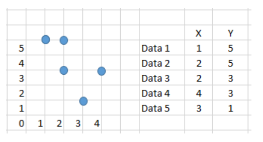

## There are 5 data as follows. Perform clustering using:

agglomerative hierarchical algorithm

* single link
* complete link

kmeans algorithm (k=2 and k=3, with the first 2 and 3 data as centroids)

## Single link

<table><tbody><tr><td> </td><td>1</td><td>2</td><td>3</td><td>4</td><td>5</td></tr><tr><td>1</td><td>0</td><td> </td><td> </td><td> </td><td> </td></tr><tr><td>2</td><td>d(2,1)</td><td>0</td><td> </td><td> </td><td> </td></tr><tr><td>3</td><td>d(3,1)</td><td>d(3,2)</td><td>0</td><td> </td><td> </td></tr><tr><td>4</td><td>d(4,1)</td><td>d(4,2)</td><td>d(4,3)</td><td>0</td><td> </td></tr><tr><td>5</td><td>d(5,1)</td><td>d(5,2)</td><td>d(5,3)</td><td>d(5,4)</td><td>0</td></tr></tbody></table>

he distance is given by:

- $d(2,1) = \sqrt{(1-2)^2+(5-5)^2} = 1$
- $d(3,1) = \sqrt{(1-2)^2+(5-3)^2} = \sqrt{5}≈2.236$
- $d(4,1) = \sqrt{(1-4)^2+(5-3)^2} = \sqrt{13}≈3.606$
- $d(5,1) = \sqrt{(1-3)^2+(5-1)^2} = \sqrt{20}≈4.472$
- $d(2,3) = \sqrt{(2-2)^2+(5-3)^2} = \sqrt{4}≈2$
- $d(2,4) = \sqrt{(2-4)^2+(5-3)^2} = \sqrt{8}≈2.828$
- $d(2,5) = \sqrt{(2-3)^2+(5-1)^2} = \sqrt{17}≈4.123$
- $d(3,4) = \sqrt{(2-4)^2+(3-3)^2} = \sqrt{4}≈2$
- $d(3,5) = \sqrt{(2-3)^2+(3-1)^2} = \sqrt{5}≈2.236$
- $d(4,5) = \sqrt{(4-3)^2+(3-1)^2} = \sqrt{5}≈2.236$

Bottom-Up (agglomerative):

<table>
<tbody>
<tr>
<td> </td><td>D1</td><td>D2</td><td>D3</td><td>D4</td><td>D5</td>
</tr>
<tr>
<td>D1</td><td>0</td><td> </td><td> </td><td> </td><td> </td>
</tr>
<tr>
<td>D2</td><td >1</td><td>0</td><td> </td><td> </td><td> </td>
</tr>
<tr>
<td>D3</td><td>2.24</td><td>2</td><td>0</td><td> </td><td> </td>
</tr>
<tr>
<td>D4</td><td>3.61</td><td>3.16</td><td>2</td><td>0</td><td> </td>
</tr>
<tr>
<td>D5</td><td>2.83</td><td>2.83</td><td>2.24</td><td>2.24</td><td>0</td>
</tr>
</tbody>
</table>
This table represents the initial distance matrix for the given data points. The smallest distance (1.0 between D1 and D2) would be highlighted or considered first in the clustering process.

In each table, the smallest distance (which determines the next merge) is highlighted in red.

1. Initial distance matrix:

<table>
<tbody>
<tr>
<td> </td><td>D1</td><td>D2</td><td>D3</td><td>D4</td><td>D5</td>
</tr>
<tr>
<td>D1</td><td>0</td><td> </td><td> </td><td> </td><td> </td>
</tr>
<tr>
<td>D2</td><td style="color: red;">$\textcolor{red}{\textsf{1}}$</td><td>0</td><td> </td><td> </td><td> </td>
</tr>
<tr>
<td>D3</td><td>2.24</td><td>2</td><td>0</td><td> </td><td> </td>
</tr>
<tr>
<td>D4</td><td>3.61</td><td>3.16</td><td>2</td><td>0</td><td> </td>
</tr>
<tr>
<td>D5</td><td>2.83</td><td>2.83</td><td>2.24</td><td>2.24</td><td>0</td>
</tr>
</tbody>
</table>

2. After merging D1 and D2:

<table>
<tbody>
<tr>
<td> </td><td>(D1,D2)</td><td>D3</td><td>D4</td><td>D5</td>
</tr>
<tr>
<td>(D1,D2)</td><td>0</td><td> </td><td> </td><td> </td>
</tr>
<tr>
<td>D3</td><td style="background-color: red;">2</td><td>0</td><td> </td><td> </td>
</tr>
<tr>
<td>D4</td><td>3.16</td><td>2</td><td>0</td><td> </td>
</tr>
<tr>
<td>D5</td><td>2.83</td><td>2.24</td><td>2.24</td><td>0</td>
</tr>
</tbody>
</table>

3. After merging (D1,D2) with D3:

<table>
<tbody>
<tr>
<td> </td><td>((D1,D2),D3)</td><td>D4</td><td>D5</td>
</tr>
<tr>
<td>((D1,D2),D3)</td><td>0</td><td> </td><td> </td>
</tr>
<tr>
<td>D4</td><td style="background-color: red;">2</td><td>0</td><td> </td>
</tr>
<tr>
<td>D5</td><td>2.24</td><td>2.24</td><td>0</td>
</tr>
</tbody>
</table>

4. Final step:

<table>
<tbody>
<tr>
<td> </td><td>(((D1,D2),D3),D4)</td><td>D5</td>
</tr>
<tr>
<td>(((D1,D2),D3),D4)</td><td>0</td><td> </td>
</tr>
<tr>
<td>D5</td><td style="background-color: red;">2.24</td><td>0</td>
</tr>
</tbody>
</table>

In each table, the smallest distance (which determines the next merge) is highlighted in red.
